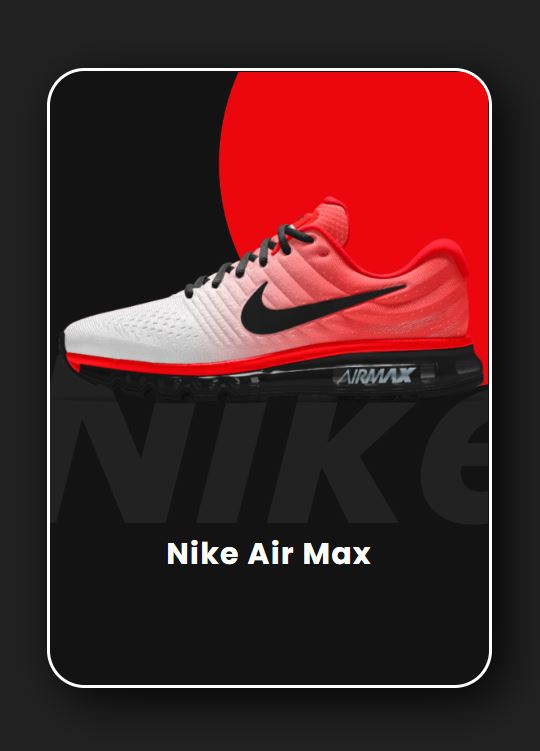

# Shoes-Card

This is a design of the Nike Shoes Card Animation on hover effect.

## Table of contents

- [Overview](#overview)
  - [The challenge](#the-challenge)
  - [Screenshot](#screenshot)
  - [Links](#links)
- [My process](#my-process)
  - [Built with](#built-with)
  - [What I learned](#what-i-learned)
- [Author](#author)

## Overview

### The challenge

Users should be able to:

- View the optimal animation on hovering your mouse to the card
- See hover states for all interactive elements on the page

### Screenshot

- Normal View - Hover View

### Links

- Solution URL: [Github](https://github.com/zaidansari42/Shoes-Card)
- Live Site URL: [Live Website](https://zaidansari42.github.io/Shoes-Card/)

## My process

### Built with

- Semantic HTML5 markup
- CSS custom properties
- Flexbox

### What I learned

I learned how to create a beautiful card with only HTML & CSS.

```html
<div class="card">
  <div class="imgbox">
    
  </div>
  <div class="contentbox">
    <h2>Nike Air Max</h2>
  </div>
</div>
```

```css
.color span:nth-child(2) {
  background-color: #ec060e;
}
.color span:nth-child(3) {
  background-color: blue;
}
.color span:nth-child(4) {
  background-color: green;
}
.color span:nth-child(5) {
  background-color: yellowgreen;
}
```

## Author

- Website - [Zaid Ansari](https://github.com/zaidansari42/)
- Twitter - [@zaidnasari42](https://www.twitter.com/zaidnasari42)
